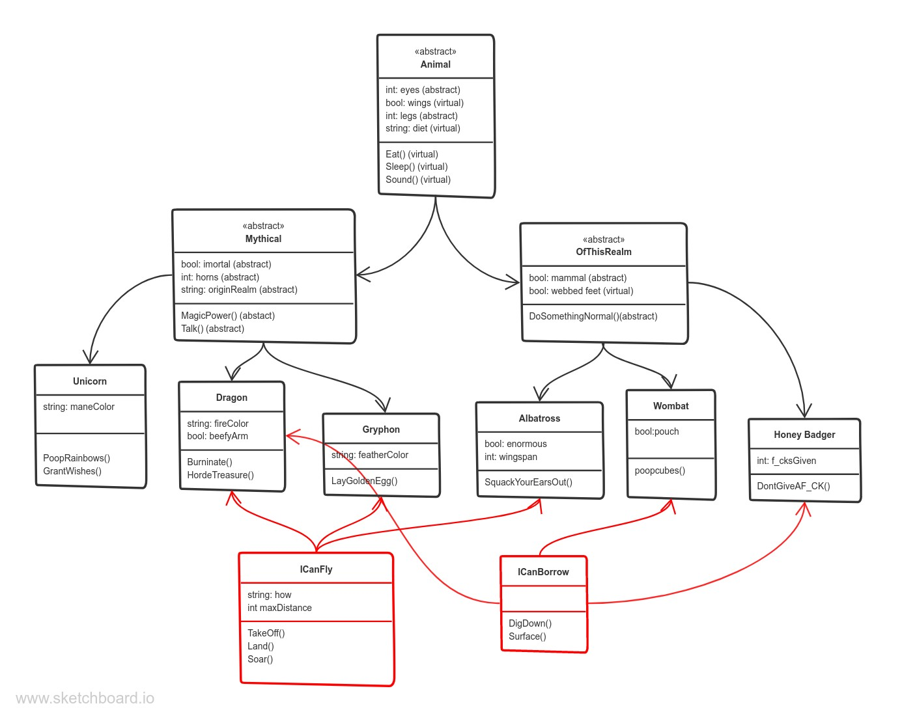

# Fake Zoo
Authors: Michael Falk, Scott Falbo  
*version 1.0.0*

## Overview
We are creating a fake zoo to practice Object Oriented Programming where in, each creature is derived from a classification class, which is derived from an animal class.

The exercise is to practice working with `abstract` and `virtual` properties as well as `override`.

## Getting Started
+ `git clone https://github.com/MikeyFalk/Lab06-OOP-Principles-.git`
+ This app has no implementation at present

## Architecture
+ `Animal()`
  + `Mythic()`
    + `Unicorn()`
    + `Dragon()`, `ICanFly`, `ICanBorrow`
    + `Gryphon()`, `ICanFly`
  + `OfThisRealm()`
    + `Wombat()`, `ICanBorrow`
    + `HoneyBadger()`, `ICanBorrow`
    + `Albatross()`, `ICanFly`
+ Interface
  + `ICanFly`
  + `ICanBorrow`

 

## Change Log

+ version 1.0.0 - *01/18/2021 4:45pm* -
  + Created the UML for the application
  + Built the top level `abstract Animal()` class.
  + Derived two classes from the `Animal()` class.
    + `abstract Mythical()`
    + `abstract OfThisWorld()`
+ version 1.0.1 - *01/18/2021 6:15pm* - 
  + Derived three concrete class from `Mythical()`:
    + `Unicorn()`
    + `Dragon()`
    + `Gryphon()`
  + Derived two concrete classes from `OfThisWorld()`:
    + `Wombat`
    + `HoneyBadger`
  + Each concrete class defines the `abstract` properties and in some cases `overrides` the `virtual` properties.
+  version 1.0.1 - *01/19/2021 4:00pm* -
  + Added Interface classes
    + `ICanFly`
    + `ICanBurrow`
+  version 1.0.1 - *01/19/2021 5:30pm* -
  + Added tests to:
    + Assert Inheritance
    + Assert method `override`
    + Assert class objects Inherited types
    + Assert interface interaction

